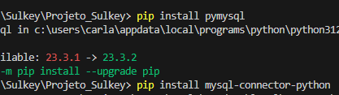
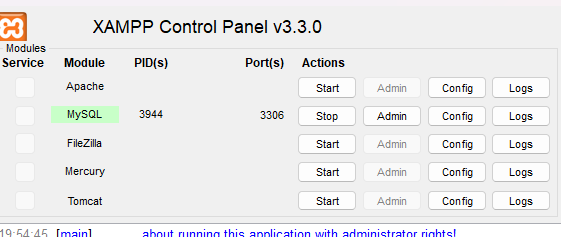
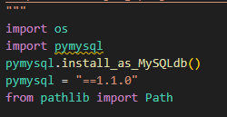
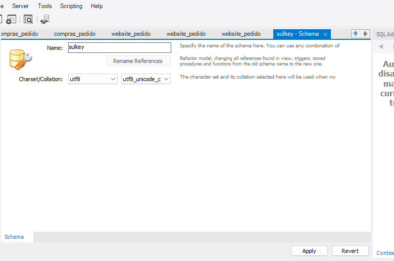
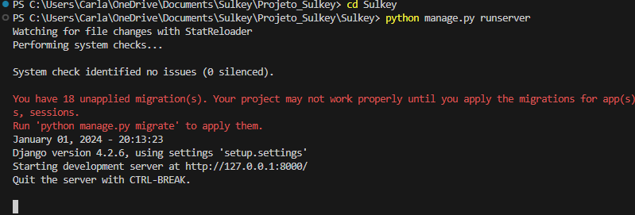

# Projeto_Sulkey
projeto em desenvolvimento

# Requisitos para iniciar o projeto:
## 📚 Build 

> ⚠️ **Requisitos:** *Python v3.12.0*, *Django v4.2.6*,  *MySQL 8.0.33*, *Pip 23.3.1*;

lucas melo desenvolvedor web: <lucasfariamelo307@gmail.com>

## 1- Interface: O projeto foi criado utilizando django framework, para isso será necessária que dentro do seu Visual Studio code siga os seguintes passos:
1.1: na pasta "Projeto_Sulkey", instale o django.

1.2: em seguida instale o conector mysql que dará acesso ao Banco de Dados: Pymysql e mysql-connector-python

1.3: após concluir estas etapas certifique-se que o xampp está ligado:

1.4: adicione as seguintes informações na parte superior do arquivo settings.py, localizado na pasta setup do proto:

1.5: agora crie o banco de dados dentro do MysqlWorkbench:

1.6: digite o nome do banco: "" e clique em aplicar!

1.7: agora no Visual Studio code ainda na pasta "" faça as migrações para o banco de dados:
Captura de tela 2023-12-21 200300.png
1.8: Por fim digite python manage.py runserver e clique no link que te levará para o projeto:

## 2-O site: A Página inicial do site da Sulkey, conta com uma interface simples e prática de forma a mostrar todos os serviços e funcionalidades da empresa
Captura de tela 2023-12-21 200728.png

